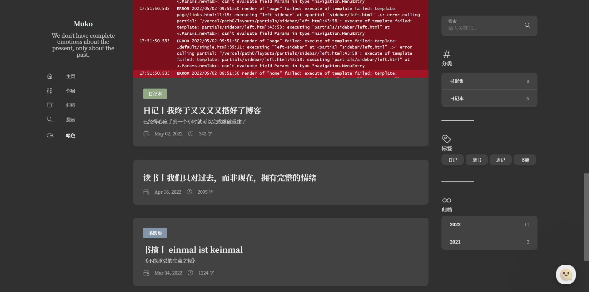
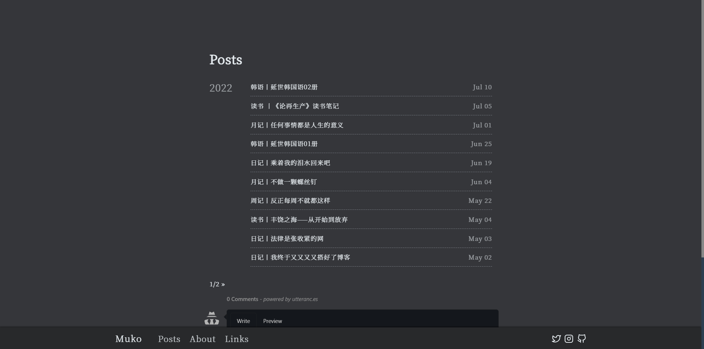
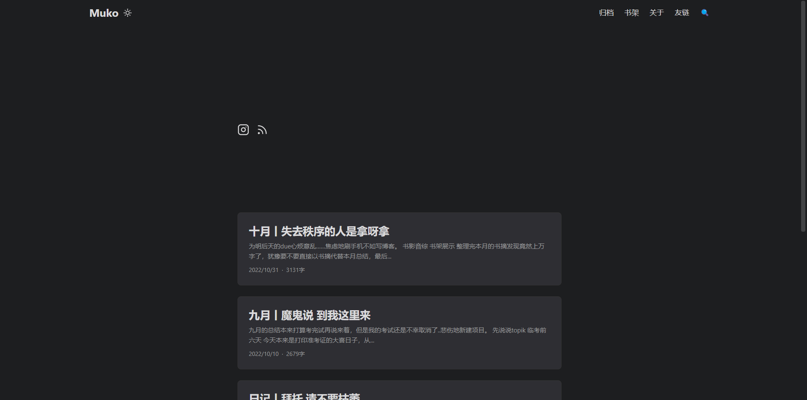
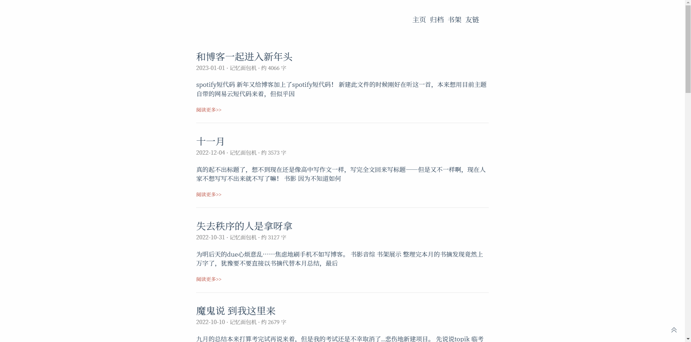
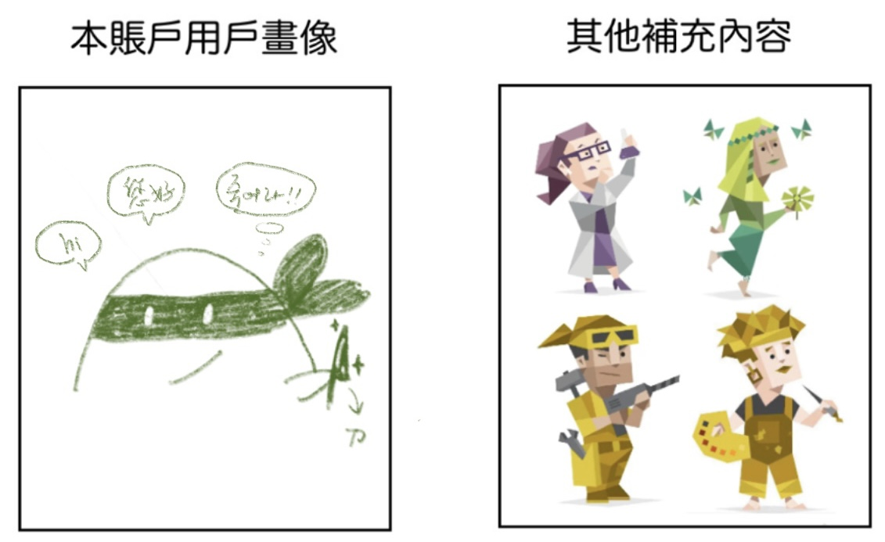


我向你们起誓，先生们，在我此刻匆匆写出的东西中，我连一个字都不信！也就是说，我似乎也相信，但与此同时，不知为什么，我又感到并且怀疑自己是在蹩脚地撒谎。



——《地下室手记》


---

## 关于博客

- 本站由[Hugo](https://gohugo.io/)驱动，主题是[FixIt](https://github.com/hugo-fixit/FixIt)，由[vercel](https://vercel.com/)部署，评论系统使用[waline](https://waline.js.org/)，favicon来自[Flaticon](https://www.flaticon.com/)，可通过[RSS](https://main.iceco.icu/index.xml)订阅；书架使用[docsify](https://docsify.js.org/#/zh-cn/)搭建，现在也是我的书影音标记平台。但本人代码水平低下——处于现用现学的状态，学不会的就改变心态不想用就好了，因此各项设置几乎都保持着初始状态。

- 博客内容大概率只有月记，月记中会把我认为最值得一说的事情拿出来讲一讲，虽然也许之后就不那样认为。本人非常三分钟热度又非常短情，做日计划永远无法连续超过两周，追星对同一个人或团的兴趣很难超过三个月——但这样我还写了大半年的月记诶，我得重视起来补充一下关于页面。

- 博客的分类页面应该非常显然：:(fa-solid fa-archive): **记忆面包机**存储着记忆，:(fa-solid fa-archive): **공부 해야돼**存放着学习笔记（在此澄清不是只放韩语笔记的分类，只是其他的什么也没学→←），:(fa-solid fa-archive): **建站笔记**是本博客重要的技术支撑。

- 左上角◌̊符号的存在理由：本站没有标题但为了充分利用左上角回到首页的功能而放置的一个看起来像是圆形按钮的摆设。

- 



--- 

## 关于我

- 一图以蔽之：
  
  

- 欢迎您的漂流瓶：
  - 
  - 
  
---
{{< style "text-align:right; strong{color:#707077;}" >}}
**更新日期：2023-02-11** 
